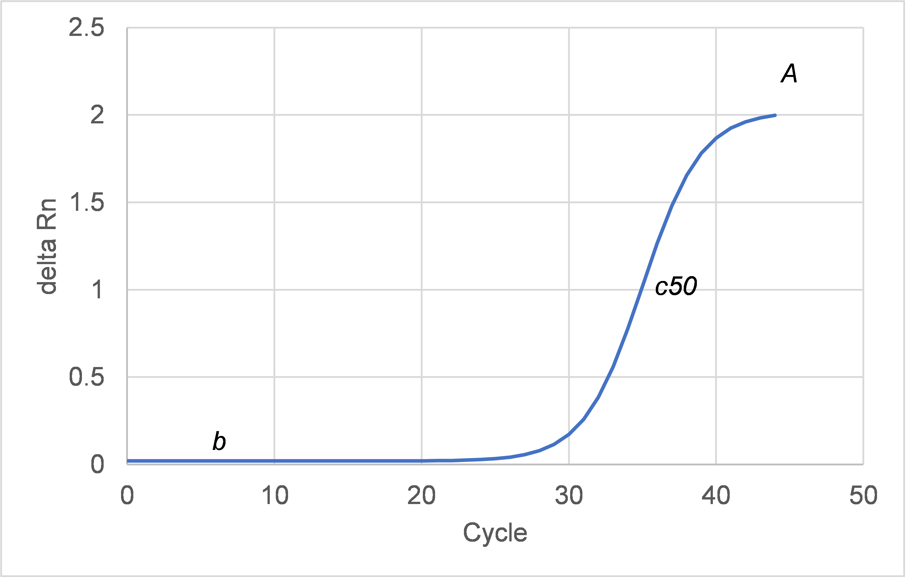
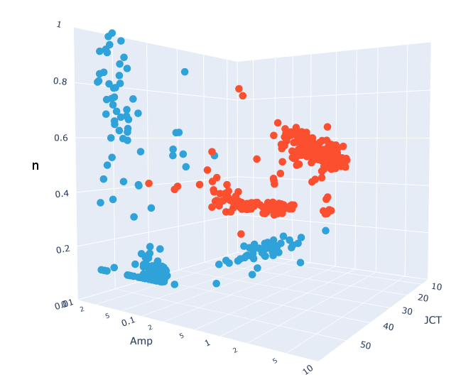
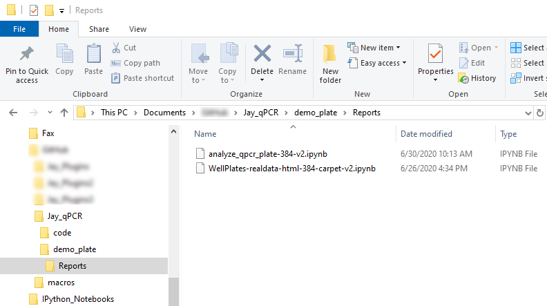
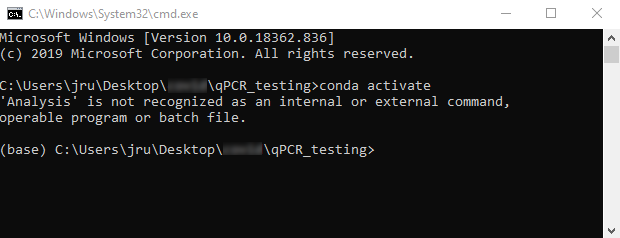
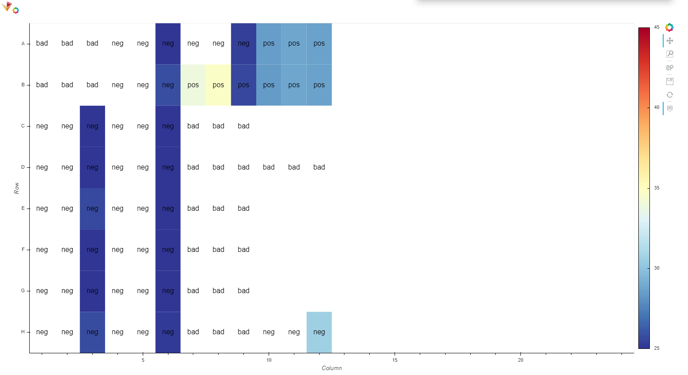
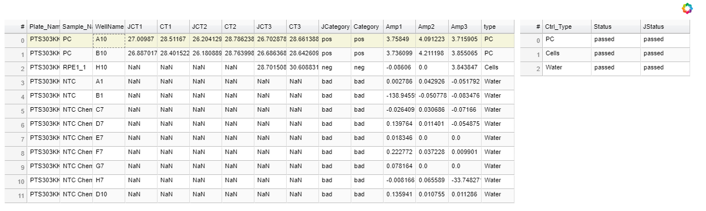
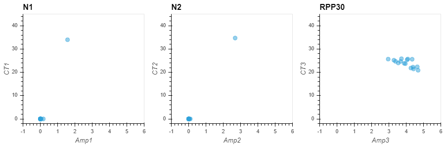
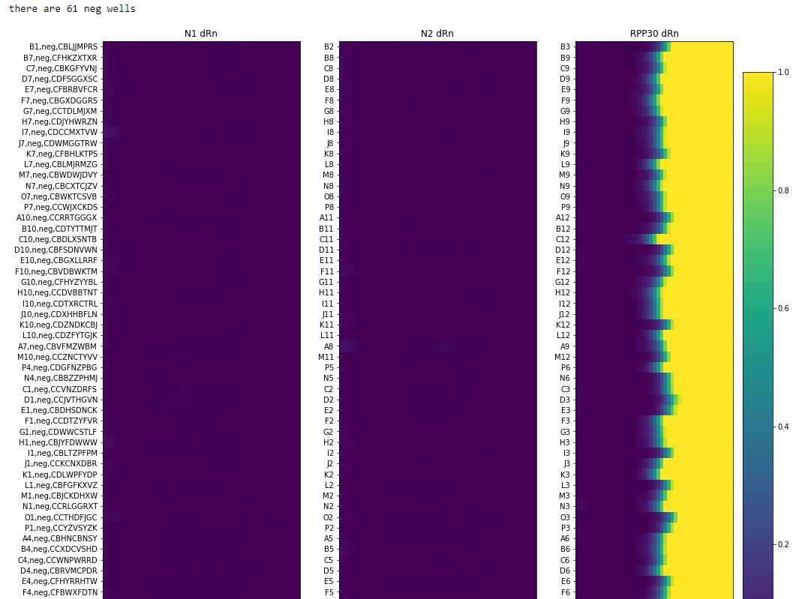

## qPCR data analysis with Python for Viral Detection
*Jay Unruh*

*Disclaimer and License:*

This software is provided as is with no guarantee of functionality or support.  Note that all clinical diagnoses must follow CDC protocols and be verified by visual inspection.  This software is only a tool to aid in that process and its metrics should never be used without visual verification.

The license for this software is the GNU GPL version 2 license (see license file) which requires all derivative code to be open source as well.  Please contact jru@stowers.org to inquire about non-open source licensing.

*Introduction:*

qPCR data analysis is straightforward in principle.  One sets a threshold level based on visual inspection of controls and data and measures the point at which curves reach this threshold.  This analysis becomes more complicated as the volume of data increases and data artifacts become prevalent.  This software package provides the tools for robust automation of such processes while maintaining the ability to visually inspect amplification curves and view Ct values from the CLIA approved QuantStudio(TM) software.

The methodology behind this software is based on logistic fitting of qPCR amplification curves (reference 1).  One can fit to more complex functions and improve accuracy slightly but this comes at the cost of less robust and automatable analysis.  The logistic function is as follows:

&Delta;*Rn*(*c*) = *A*/[1 + exp(-*n*(*c* - *c50*))].

Here *A* is the asymptotic amplitude of the amplification, *n* is a steepness factor, and *c50* is the cycle (*c*) at which 50% amplification has occurred.  Here is a graphical representation of this curve:

A typical CDC workflow involves setting a threshold well above the baseline but in the rapidly rising portion of the curve.  Since our fit accurately determines the curve baseline, we can define this point mathematically.  One limitation of this approach is knowing where to set that value on the y axis.  The best option is to have a positive control with the target RNA corresponding to the well of interest.  The threshold value can then be set as 5% of the amplitude of that target well.  Once the threshold is set, the Ct value is defined for each well as follows:

*Ct* = *c50* - ln[*A*/*threshold* - 1]/*n*

A few notes should be made as to the algorithm used for fitting.  The software uses Levenberg-Marquardt non-linear least squares with a few modifications.  After each fitting iteration, values outside constraints on the parameters are returned to their closest constrained value.  The initial fitting parameters are found by searching for the best possible c50 values by 5% increments with linear least squares determination of A and b values at each increment.  The minimum and maximum c50 values are 5 and 55 cycles, respectively.  The n (steepness) value is initialized to 0.5.  The b value is then constrained to +/- 10% of the initialized A value.  The A value is constrained between 0 and 5 times the initialized A value.  The n value is constrained between 0.1 and 2.0.

Reference:
1.	Spiess AN, Feig C, Ritz C. Highly accurate sigmoidal fitting of real-time PCR data by introducing a parameter for asymmetry. BMC Bioinformatics. 2008;9:221.

*Parameter optimization (non-machine learning):*

In order to understand the characteristics of real experimental samples, we fit 1014 samples to logistic functions.  These samples were a combination of pseudovirus dilution samples, no template control samples (e.g. water), and Rpe1 negative control samples.  All curves were visually inspected and labeled positive or negative.  548 of the curves were negative and 466 were positive.  We observed that the baseline (b) parameter correlated little if at all with the positive or negative status of a sample.  Therefore, we focused on the amplitude, steepness, and Ct values.

Here the blue curves are the negative values and the red are positive.  If we limit the Ct value to between 15 and 45, the amplitude to between 0.1 and 10, and the n value to between 0.2 and 0.8, we can efficiently separate the positives from the negatives.  For this data, those limits give us 100% correct negative assignment and 98.3% correct positive assignment.  The curves that are incorrectly deemed negative are those with very low concentration of pseudovirus.

Our strategy then is to provide the analyst with multiple sources of information: the Ct values form the QuantStudio(TM) software, the raw curves, and the filtered Ct value from the analysis above (termed JCT).  In this way, the best decision can be made quickly by integrating all sources of information.

*File Organization/Format:*

All qPCR data is assumed to have sets of 3 grouped wells with two query RNA targets and one control RNA target.  For example A1, A2, and A3 would be query1, query2, and control, respectively.  The QuantStudio(TM) file format (extension .eds) is actually a zip file format that can be opened with utilities such as 7-zip or the python zipfile utility.  The EDSReader.py code file has a function called getEDSData(fpath) that reads data out of this file.  The delta Rn values and results (including Ct values) from the QuantStudio(TM) analysis are in a zipped file called analysis_result.txt.  Other metadata is in plate_setup.xml and experiment.xml.  Lately, we have been using version 2.4 of the Design and Analysis software.  That software saves it's output in a slightly different format with json files.  The files analysis_result.json, plate_setup.json, and summary.json are roughly equivalent to the above files in the older format.  Note that the D&A 2.4 software corrects some errors we have had with background correction in the older QS software.  I am pulling a few tags from those files but it should be straightforward to pull other tags if needed.

*Software description:*

The software is written in python with jupyter notebooks for visualization and report generation.  Pandas dataframes with numpy are used for data manipulation and matplotlib and holoviews (via bokeh) are used for visualization purposes.  Installation of miniconda3 and those packages according to conda installation protocols should be sufficient to run the code.

Most of the code is in the qPCR_analysis_functions.py file which relies on NLLSfit.py and FitLogistic.py for fitting.  Those files reside in a folder entitled “code”.  The initial qPCR analysis and fitting takes place in analyze_qpcr_plate-384-v2.ipynb which should be one folder below the .eds file in the file system (e.g. inside a “Reports” folder).  Running that notebook fully will produce an html file with the same name that can be used statically to show results on machines without python installed.  You may have to save the notebook and rerun the last cell to get the html to generate correctly. 

WellPlates-realdata-html-384-carpet_v2.ipynb creates the visual report for the controls and the data.  Note that the “makeCtrlReport” function requires sample names for positive controls, controls with RNA only in the third control well, and blank controls (e.g. water).  These names are pulled from the qPCR files.

Note that for 96 well data the organization is similar but there are up to 4 eds files and the data gets organized into a 384 well format for analysis and visualization.  The first plate goes in A1-H12, the second plate goes in I1-P12, the third plate goes in A13-H24, and the fourth plate goes in I13-P24.

Here is a picture of our folder organization:

*Run Walk-through:*

Upon setting up the data analysis folders, you will want to run a jupyter notebook from somewhere in your data folder.  On windows, it is easiest to simply type “cmd” in the address bar of the data storage folder.  Alternatively, you can search for anaconda prompt in the windows search bar.  At this point you will need to navigate to your file location.

Once you have a command prompt in your data analysis folder, type “conda activate” (this is unnecessary if you started with the anaconda prompt).  Your cursor should now start with (base):

Next, type “jupyter notebook” and press enter.  This will take you to a webpage with a browser window showing your current folder.  You can click on a subfolder to navigate.  Navigate to the reports folder in the plate subfolder and click on the analyze_qpcr_plate-384-v2.ipynb file.

Jupyter notebooks has several tools at the top that allow you to control execution:

The >> button simply executes the entire file at one shot.  This will work for most applications.  You can also run one block at a time with the Run button and stop and restart execution with the square and circle arrow buttons.  This file has relatively little interesting output but you’re welcome to peruse it.  Note that you can always peruse it after the fact by opening the html file of the same name that is produced upon running the notebook all the way through.

Note that 4 cells up from the end of the file is the JCT calculation routine along with thresholding values and control well locations if those need to be changed.  3 cells up from the bottom is the categorization routine with the Ct limit value (default is 40).

This file will produce csv files in the main folder (one level above the Reports folder) with the same base name as the .eds file but ending with “results”, “curves”, and “combined”.  These files have the well-by-well results, the delta Rn curves, and the combined triple well results, respectively.

The next step is to run the “WellPlates-realdata-html-384-carpet-v2.ipynb” file.  This file presents the most important metrics for triaging test results.  Once again, you may opt to click the >> button to run the entire file and browse the results in the html output.

The first visualization is the plate heatmap.  Wells are colored by their Ct values and white if amplification is not detected.  The text on each well shows the test status for that set of 3 wells.  If you mouse over the wells, a tooltip will show you the sample name, category, and Ct value as well as my Ct value and Category (JCT and JCategory) as described above.  Note that this visualization includes the controls and the samples.

The next important visualization is the control report.  The left-hand table shows all control well results while the right hand table summarizes the control status.  If any of the status values do not say “passed” the entire plate analysis must be reassessed.

Next, is an interactive scatter plot of Ct vs. Amplification levels for the three wells corresponding to each sample (here they are named N1, N2, and RPP30 but they may be named differently for your assay).  You can scroll and zoom in on points and hover over them to see details.  There is one set of plots for controls and one for the sample wells.  This plate shows a fairly typical result.  All human RNA (RPP30) values are high, indicating good RNA extraction and all but one viral RNA value is low indicating a single positive sample (in this case a blind control).

It is typical to visually confirm amplification for positive samples.  For plates with few positive samples, this is fairly straightforward within the QuantStudio(TM) software or a plot like above.  It is more difficult to confirm lack of amplification for negative samples.  The presence of “horsetail” amplification makes such assessments even more difficult.  I have settled on a “kymograph” visualization method where each horizontal block represents the amplification profile (in heatmap form) for a well.  Here are all of our negative wells.

As you can see all of the human RNA samples (here RPP30) are strongly positive.  I saturate the signal levels to focus on potentially weak amplification.  You can see how G4 on the left and F4 in the middle had horsetail amplification but are clearly negative.

The next few cells have options for manually swapping categories, but this notebook outputs a file with “calls” at the end that can be manually edited easily with a spreadsheet program.  Given an appropriate plate translation worksheet in the code folder, the program will also output the original source well location.

This code is still a work in progress and I will post updates here when they are available but my hope is that this resource will provide a starting point for other developers looking to automate and streamline qPCR viral testing pipelines.